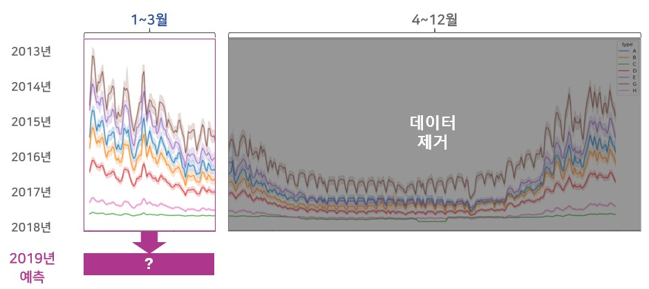
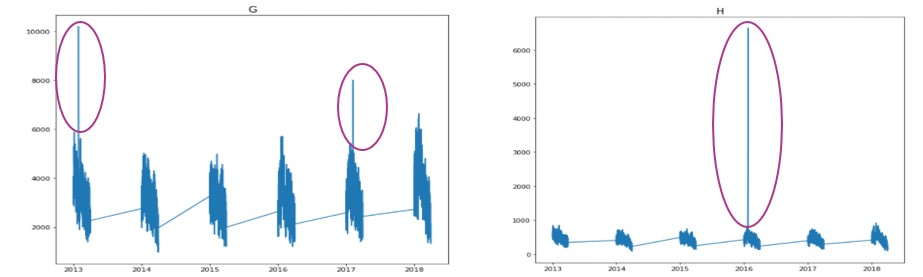
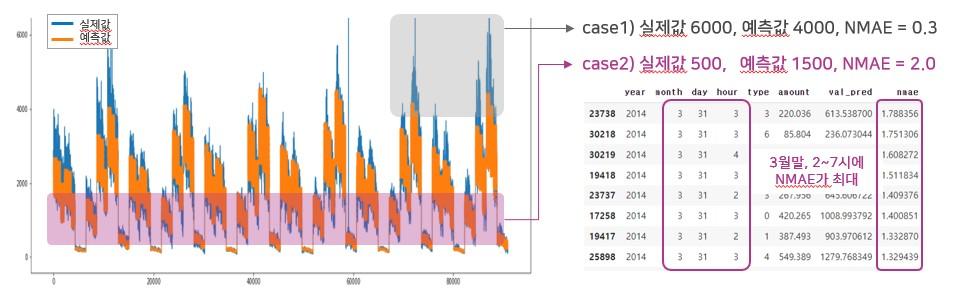
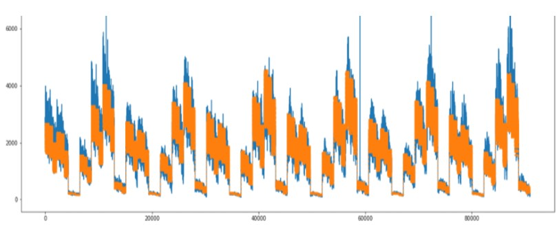
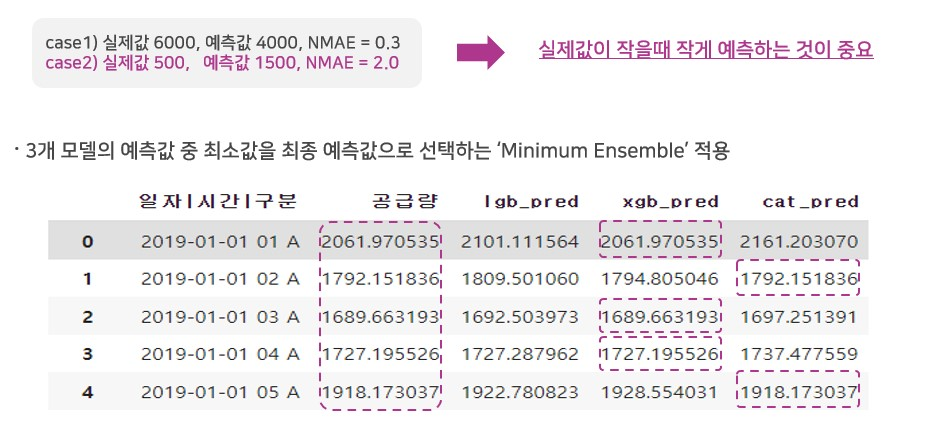

# 가스공급량 수요예측 모델개발

## 0. 대회 개요
- 목적: 전국 도시가스 공급량의 시간단위 데이터를 활용하여 90일간 공급량을 예측
- 주최: 한국가스공사
- 참가대상: 스타트업 및 예비창업가
- 평가지표: NMAE(Normalized Mean Absolute Error)
- [대회 홈페이지1](https://kogasbigstar.kr)
- [대회 홈페이지2](https://dacon.io/competitions/official/235830/overview/description)


## 1. 데이터
- Shape: 368,088 rows × 4 columns
- 컬럼: 연월일, 시간, 공급사, 공급량
- 학습구간: 2013년 1월 1일 ~ 2018년 12월 31일(6년)
- 예측구간: 2019년 1월 1일 ~ 2019년 3월 31일(90일)
- [데이터 소스](https://dacon.io/competitions/official/235830/data)

## 2. 외부데이터 검토
가스 공급량과 관련이 높은 가스 가격, 기상정보, 공휴일 관련 외부데이터의 모델 적용 시도
| 데이터 | 출처 | 적용방법 |
|:-|:-|:-|
| 도시가스 월별 상대가격 지수 데이터 | 한국가스공사 | 민수용, 산업용 가스 상대가격 변수 추가 |
| 기상정보 데이터 | 기상자료개방포털 | 온도, 강수 등 월평균 값 추출후 3개월 Lagging 변수 추가 |
| 지역별 특수일 효과 | 한국가스공사 | 평일 대비 특수일 가스 수요 감소 비율 적용 |
| 공휴일 데이터 | 한국천문연구원 특일정보 API | 명절, 국경일 등 공휴일 변수 추가 |

대회 규정상 예측기간 이전(~'18.12.31)의 데이터만 사용가능함. Data Leakage를 피하기 위해 1)월평균 값 적용, 2)'18년 12월 값 적용, 3)예측기간의 외부 데이터 값 예측 등으로 외부데이터를 적용해 보았으나 성능이 개선되지 않았음. 또한 공급사가 위치한 지역을 알 수 없어 외부데이터를 활용하기가 더욱 어려웠음.

최종적으로 외부데이터는 사용하지 않고, 제공된 데이터만 사용

## 3. 전처리

### 3.1. 데이터 기간 제한
가스 공급량 예측을 위해 과거 6개년의 1-12월 데이터가 제공되었고, 미래의 1-3월을 예측해야 함. 데이터에는 이상치가 다수 존재하였으나, IQR등 일괄적인 이상치 처리는 Domain 정보가 손실될 우려가 있음. 평가 데이터와 같은 기간(1~3월)의 데이터만 사용하여 불필요한 Noise를 제거하고 모델 학습 효율을 향상시킴 
<p align="center">
    
</p>

### 3.2. EDA를 통한 이상치 처리
가스 공급량 이상치는 일시적 과대수요, 설비정비, Data 작성 오류 등 다양한 원인에 기인함. IQR 등 일반적인 이상치 처리 방법 적용시 Domain 정보가 과도하게 손실될 우려가 있음. EDA 결과를 바탕으로 모델 학습에 방해가 되는 구간에 한하여 최소한의 이상치 처리를 실시
<p align="center">
    
</p>

```yaml

# 2016년 H 공급사 이상치는 +1, -1 일 동시간의 공급량 평균으로 대체
for row in train[(train['type'] == 6) & (train['year'] == 2016) & (train['month'] == 1) & (train['day'] == 24) & (train['hour'] < 4)&(train['amount'] > 800)].index:
  train.loc[row, 'amount'] = (train.loc[(row-24), 'amount'] + train.loc[(row+24), 'amount'])/2

# 공급량 6644이상인 것은 이상치로 판단하고 +1, -1 시간의 공급량 평균으로 대체
for row in train[train['amount'] > 6644].index:
  train.loc[row, 'amount'] = (train.loc[(row-1), 'amount'] + train.loc[(row+1), 'amount'])/2
```

### 3.3. 예측 취약구간 보완
학습데이터의 공급량 예측값과 실제 공급량의 차이를 비교한 결과 특정구간에서 예측력이 떨어짐을 확인. 평가지표(NMAE)특성상 공급량이 적은 구간에서의 예측력이 점수에 더 큰 영향을 미침. 공급량이 적고 예측력이 떨어지는 구간을 변수로 추가하여 부정확한 예측을 보완함
<p align="center">
    
</p>

```yaml

# 예측력이 떨어지는 기간 피쳐화 (3월말, 2~4시)
for df in [train, test]:
  df['little_gas'] = 0
  df.loc[(df['month'] == 3) & (df['day'] >=29) & (df['hour'] >=2) & (df['hour'] <=4), 'little_gas'] = 1
  df['26~31'] = df['day'].apply(lambda x : 1 if x >= 26 else 0)
  df['2~7'] = df['hour'].apply(lambda x : 1 if x >= 2 and x <= 7 else 0)
```

## 4. 모델 선정
관련 논문, 유사 경진대회에 사용된 모델 7종에 대해 분석 및 성능 평가후 최종 모델을 결정

### 4.1. 시계열 모델 : ARIMA, FBprophet
가스 수요량을 예측하기 위한 모형 구축에서 중요한 요인은 계절성이라고 판단. 더불어 요일을 포함한 공휴일이 많고 적음에 따라 수요량의 차이가 발생하므로 시계열 모델을 사용. 
- ARIMA : 과거 데이터를 기반으로 현재를 설명하는 시계열 데이터 기반 분석 기법. 추세와 계절성을 반영한 시계열 예측의 대표 모델. 크고 다양한 형태를 가지는 시계열 자료에서는 좋은 성능을 발휘하지 못함. 테스트 결과 Bad
- FBprophet : 연도 별, 주별, 일별, 계절성과 휴일효과에 반영할 수 있는 시계열 모델. 누락된 데이터와 추세 변화에 강함. 일반적으로 이상 값 처리가 잘 됨. 정확도가 높고 빠르며 직관적인 파라미터로 모델 수정이 용이. ARIMA와 마찬가지로 대규모 다차원 데이터셋에서는 좋은 성능을 발휘하지 못함. 테스트 결과 Not Bad

### 4.2. 딥러닝 모델 : LSTM
시계열 문제 및 예측 문제에서 좋은 성능을 발휘하는 학습 모델인 LSTM 모델을 테스트 함. 과거 학습 정보를 기억하고 새로운 학습 결과에 반영될 수 있도록 설계된 모델. 순차적인 입력 데이터 간의 거리가 멀어도 과거의 특징을 더 잘 기억하고 학습 할 수 있음. 결과물이 직전 패턴을 기반으로 수렴한다는 단점 존재. 테스트 결과 Bad

### 4.3. 트리계열 모델 : RandomForest, XGB, LGBM, Catboost
- RandomForest : 트리-배깅 모델. 다수 Decision Tree를 사용하므로 Variance가 낮아짐. 데이터 크기가 크면 연산속도가 느림. 테스트 결과 Not Bad
- XGB : 부스팅 모델. GBM 모델 대비 빠른 수행시간. 과적합 규제 기능. 트리계열 모델 중 시계열 예측이 우수. 테스트 결과 Good
- LGBM : 부스팅 모델. 데이터 수가 적을수록 과적합 가능성 높음. 적은 메모리를 사용하고 병렬처리를 통해 빠른 속도로 학습 가능. 테스트 결과 Good
- Catboost : 범주형 변수의 예측모델에 최적화. LGBM의 Overfitting 문제 극복. 테스트 결과 Good


### 4.4. 최종모델 선정 : XGB, LGBM, Catboost
시계열 모델 및 LSTM은 테스트 결과가 매우 좋지 않아 사용하지 않음. 테스트 결과가 가장 좋은 XGB, LGBM, Catboost를 최종모델로 선정. 그중 모델링 속도가 가장 빠른 LGBM을 Baseline 모델로 활용.

트리모델의 경우 시계열 모델 처럼 데이터의 추세를 반영하기 어렵고, 과거 관측된 범위내에서 예측하는 단점이 있으나, 제공된 관측 데이터가 충분히 크고, 새로운 추세변화가 발생하기 어려울 것이라는 판단하에 트리모델만 적용함.

3개 모델을 Ensemble 하여 예측값 도출


## 5. 모델 훈련
사용 변수 최소화 및 Custom Tuning으로 일반화된 예측모델을 구현

### 5.1. 변수 제한
사용하는 변수를 최소화하여 과적합 가능성이 낮은 일반화된(Generalized) 예측 모델을 구현

```yaml
vars = ['hour',	'type', 'month', 'weekday', 'little_gas', '26~31','2~7']
X = train[vars]
X_test = test[vars]
```

### 5.2. Custom Metric
대회 평가지표 'NMAE'를 각 모델별 Custom Metric으로 지정하여 모델 훈련
```yaml
def NMAE(y_pred, train_data):
  y_true = train_data.get_label()
  y_pred = np.expm1(y_pred)
  y_true = np.expm1(y_true)
  score = np.mean((np.abs(y_true-y_pred))/y_true)    
  return 'nmae', score, False
model = lgb.train(params, train_set=d_training, feval = NMAE)
```

### 5.3. Hyperparameter Tuning
Optuna, Grid Search 사용시 과적합되는 경향이 있어 학습 데이터의 공급량 예측값 시각화 결과를 확인하며 수동으로 조정
<p align="center">
    
</p>

### 5.4. Kfold
Kfold는 3~24 까지 적용 후 모델별 최적 Fold수 선택(XGB-24, LGBM-6, Catboost-12) 


## 6. 추론
수요예측 비즈니스의 특성과 평가지표(NMAE)를 고려하여 과대추정 보다는 과소추정이 합리적이라고 판단함. NMAE 지표는 공급량이 적은 구간의 예측력이 중요. 과대추정 방지를 위해 최소값을 예측하는 Minimum Ensemble 적용
<p align="center">
    
</p>

## 7. 결과
1차평가 10위(NMAE 0.094), 최종평가 결과 예비창업가 부문 3위


## 8. 참고자료

### 8.1. 논문
- 도시가스 수요량 예측을 위한 시계열 모형 개발(2009) 최보승, 강현철, 이경윤, 한상태
- 국내 도시가스의 시간대별 수요 예측(2016) 한정희, 이근철
- 머신 러닝 방법과 시계열 분석 모형을 이용한 부동산 가격지수 예측(2018) 배상완, 유정석
- 외재적 변수를 이용한 딥러닝 예측 기반의 도시가스 인수량 예측(2019) 김지현, 김지은, 박상준, 박운학
- 함수 주성분 분석을 이용한 일별 도시가스 수요 예측(2020) 최용옥, 박혜성
- 도시가스 일 최대수요 예측에 관한 연구(2020) 박철웅, 박철호

### 8.2. 데이터
- 도시가스 월별 상대가격 지수 데이터 (출처 : 한국가스공사)
- 기상 정보 데이터 (출처 : 기상자료개방포털)
- 지역별 특수일 효과 (출처 : 한국가스공사)
- 공휴일 데이터 (출처 : 한국천문연구원 특일정보 API)

### 8.3. 경진대회
- 전력 사용량 예측 AI 경진대회(데이콘)
- 태양광 발전량 예측 AI 경진대회(데이콘)

